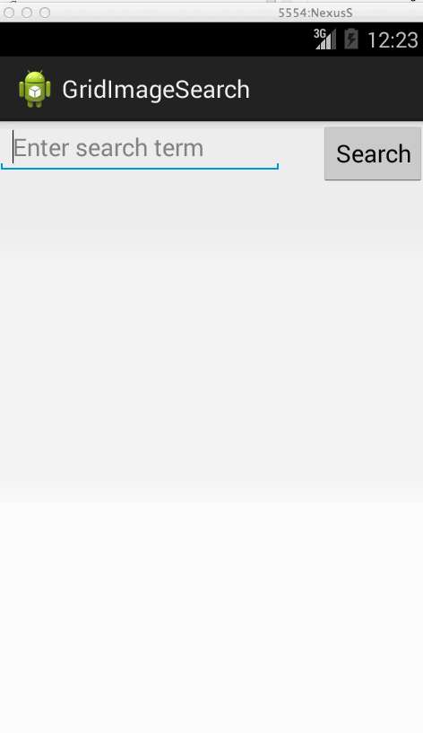

# Grid Image Search

Assignment 2 for CodePath Android class
by Keithen Hayenga
17 June 2014

Hours Spent: 18

Description:

Search Google API image database to find images that meet search criteria. Display
images found in a gridview and when selecting a single image, display just that image full screen.

User Stories:

 * [x] User can enter a search query that will display a grid of image results from the Google Image API.
 * [x] User can click on "settings" which allows selection of advanced search options to filter results
 * [ ] User can configure advanced search filters such as:
        Size (small, medium, large, extra-large)
        Color filter (black, blue, brown, gray, green, etc...)
        Type (faces, photo, clip art, line art)
        Site (espn.com)
 * [ ] Subsequent searches will have any filters applied to the search results
 * [x] User can tap on any image in results to see the image full-screen
 * [ ] User can scroll down “infinitely” to continue loading more image results (up to 8 pages)

The following advanced user stories are optional:

 * [ ] Optional: Robust error handling, check if internet is available, handle error cases, network failures
 * [ ] Optional: Use the ActionBar SearchView or custom layout as the query box instead of an EditText
 * [ ] Optional: User can share an image to their friends or email it to themselves
 * [ ] Optional: Replace Filter Settings Activity with a lightweight modal overlay
 * [ ] Optional: Improve the user interface and experiment with image assets and/or styling and coloring
 * [ ] Optional: Use the StaggeredGridView to display visually interesting image results
 * [ ] Optional: User can zoom or pan images displayed in full-screen detail view

Status

I have the endless scrolling under way, but right now my extra reading of data only covers the original images instead of adding to it. I believe that i don't have enough images on the screen to enable scrolling, so the changes to get more images is never called.

The screen for options is also started, but i was planning to allow the strings in the spinners to be internationalized. So that means i needed ways to convert the strings necessary for Google API calls to be converted back and forth into indexes to set the spinner starting values. I just didn't eet that done. 

And i have a crash on return from the options screen. Never had a chance to look at it.

Installation Instructions:
 

Libraries Used:

 * android-async-http-1.4.4.jar
 * android-smart-image-view-1.0.0.jar

Notes:

Walkthrough of user stories:

GIF created with [LiceCap](http://www.cockos.com/licecap/).
