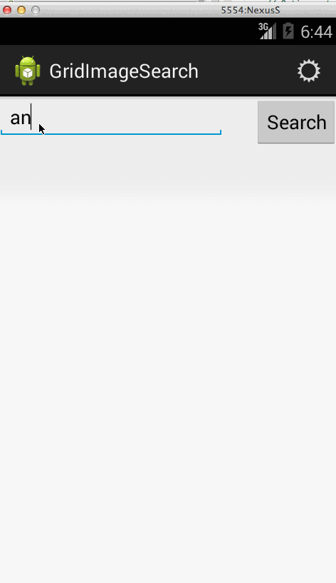
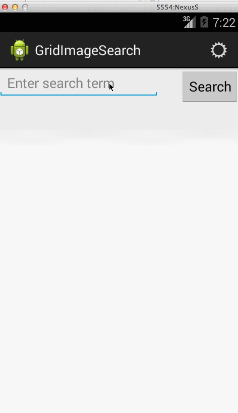

# Grid Image Search

Assignment 2 for CodePath Android class
by Keithen Hayenga
18 June 2014

Hours Spent: 25

Description:

Search Google API image database to find images that meet search criteria. Display
images found in a gridview and when selecting a single image, display just that image full screen.

User Stories:

 * [x] User can enter a search query that will display a grid of image results from the Google Image API.
 * [x] User can click on "settings" which allows selection of advanced search options to filter results
 * [x] User can configure advanced search filters such as:
        Size (small, medium, large, extra-large)
        Color filter (black, blue, brown, gray, green, etc...)
        Type (faces, photo, clip art, line art)
        Site (espn.com)
 * [x] Subsequent searches will have any filters applied to the search results
 * [x] User can tap on any image in results to see the image full-screen
 * [x] User can scroll down “infinitely” to continue loading more image results (up to 8 pages)

The following advanced user stories are optional:

 * [ ] Optional: Robust error handling, check if internet is available, handle error cases, network failures
 * [ ] Optional: Use the ActionBar SearchView or custom layout as the query box instead of an EditText
 * [ ] Optional: User can share an image to their friends or email it to themselves
 * [ ] Optional: Replace Filter Settings Activity with a lightweight modal overlay
 * [ ] Optional: Improve the user interface and experiment with image assets and/or styling and coloring
 * [ ] Optional: Use the StaggeredGridView to display visually interesting image results
 * [ ] Optional: User can zoom or pan images displayed in full-screen detail view

Bonus: I did set the option screen up to work even when nationalized. (German language strings not checked in, but can be seen working at bottom of README.)

Status

Installation Instructions:
 

Libraries Used:

 * android-async-http-1.4.4.jar
 * android-smart-image-view-1.0.0.jar

Notes:

Walkthrough of user stories:
(Options screen internationalized to German below.)

GIFs created with [LiceCap](http://www.cockos.com/licecap/).
